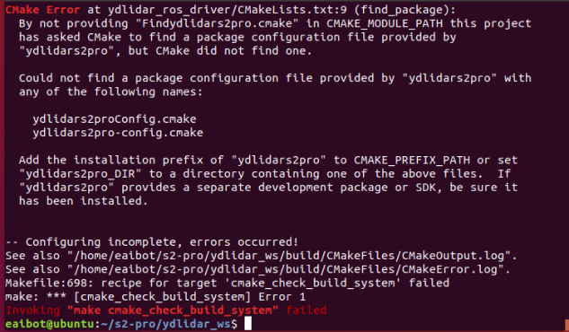

# YDLIDAR ROS Driver

ydlidar_ros_driver is a new ros package, which is designed to gradually become the standard driver package for ydlidar devices in the ros environment.

## Compile & Install YDLidar SDK

ydlidar_ros_driver depends on YDLidar-SDK library. If you have never installed YDLidar-SDK library or it is out of date, you must first install YDLidar-SDK library. If you have installed the latest version of YDLidar-SDK, skip this step and go to the next step.

1. Download or clone the [YDLIDAR/YDLidar-SDK](https://github.com/YDLIDAR/YDLidar-SDK) repository on GitHub.
2. Compile and install the YDLidar-SDK under the ***build*** directory following `README.md` of YDLIDAR/YDLidar-SDK.

## Clone ydlidar_ros_driver

1. Clone ydlidar_ros_driver package for github : 

   `git clone https://github.com/YDLIDAR/ydlidar_ros_driver.git ydlidar_ws/src/ydlidar_ros_driver`

2. Build ydlidar_ros_driver package :

   ```
   cd ydlidar_ws
   catkin_make
   ```
   <font color=Red size=4>>Note: If the following error occurs, Please install  [YDLIDAR/YDLidar-SDK](https://github.com/YDLIDAR/YDLidar-SDK) first.</font>

   

3. Package environment setup :

   `source ./devel/setup.sh`

    Note: Add permanent workspace environment variables.
    It's convenientif the ROS environment variables are automatically added to your bash session every time a new shell is launched:
    ```
    $echo "source ~/ydlidar_ws/devel/setup.bash" >> ~/.bashrc
    $source ~/.bashrc
    ```
4. Confirmation
    To confirm that your package path has been set, echo the `ROS_PACKAGE_PATH` variable.
    ```
    $ echo $ROS_PACKAGE_PATH
    ```
    You should see something similar to:
        `/home/tony/ydlidar_ws/src:/opt/ros/melodic/share`

5. Create serial port Alias [optional] 
    ```
	$chmod 0777 src/ydlidar_ros_driver/startup/*
	$sudo sh src/ydlidar_ros_driver/startup/initenv.sh
    ```
    Note: After completing the previous operation, replug the LiDAR again.
	

## Run ydlidar_ros_driver

##### Run ydlidar_ros_driver using launch file

The command format is : 

 `roslaunch ydlidar_ros_driver [launch file]`

1. Connect Triangle LiDAR uint(s).
   ```
   # G4, G5
   roslaunch ydlidar_ros_driver lidar_view.launch 
   ```

2. Connect to TOF LiDAR uint(s).
   ```
   # TG15, TG30, TG50
   roslaunch ydlidar_ros_driver TG.launch 
   # TX8, TX20
   roslaunch ydlidar_ros_driver TX.launch 
   ```
3. Connect to TOF NET LiDAR uint(s).
   ```
   # T5, T15
   roslaunch ydlidar_ros_driver T15.launch 
   ```

#####  Launch file introduction

The driver offers users a wealth of options when using different launch file. The launch file directory    

is `"ydlidar_ws/src/ydlidar_ros_driver/launch"`. All launch files are listed as below : 

| launch file               | features                                                     |
| ------------------------- | ------------------------------------------------------------ |
| G1.launch         | Connect to G1 LiDAR<br/>Publish LaserScan message on `scan` topic |
| G2.launch         | Connect to G2 LiDAＲ<br/>Publish LaserScan message on `scan` topic |
| G6_G7.launch      | Connect to G6/G7 LiDAR<br />Publish LaserScan message on `scan` topic |
| lidar.launch      | Connect to G4/G5 LiDAR<br />Publish LaserScan message on `scan` topic |
| lidar_view.launch | Connect to G4/G5 LiDAR<br />Publish LaserScan message on `scan` topic <br/>Automatically load rviz |
| T15.launch        | Connect to T5/T15 LiDAR<br />Publish LaserScan message on `scan` topic |
| TG.launch         | Connect to TG15/TG30/TG50 LiDAR<br />Publish LaserScan message on `scan` topic |
| TX.launch         | Connect to TX8/TX20 LiDAR<br />Publish LaserScan message on `scan` topic |
| X2.launch         | Connect to X2/X2L LiDAR<br />Publish LaserScan message on `scan` topic |
| X4.launch         | Connect to X4 LiDAR<br />Publish LaserScan message on `scan` topic |

## Publish Topic
| Topic                | Type                    | Description                                      |
|----------------------|-------------------------|--------------------------------------------------|
| `scan`               | sensor_msgs/LaserScan   | 2D laser scan of the 0-angle ring                |
| `laser_fan`           | ydlidar_ros_driver::LaserFan   | 2D Raw laser fan of the 0-angle ring                |

## Subscribe Service
| Service                | Type                    | Description                                      |
|----------------------|-------------------------|--------------------------------------------------|
| `stop_scan`          | std_srvs::Empty   | turn off lidar                                         |
| `start_scan`         | std_srvs::Empty   | turn on lidar                                          |


## Configure ydlidar_ros_driver internal parameter

The ydlidar_ros_driver internal parameters are in the launch file, they are listed as below :

| Parameter name | Data Type | detail                                                       |
| -------------- | ------- | ------------------------------------------------------------ |
| port         | string | Set Lidar the serial port or IP address <br/>it can be set to `/dev/ttyUSB0`, `192.168.1.11`, etc. <br/>default: `/dev/ydlidar` |
| frame_id     | string | Lidar TF coordinate system name. <br/>default: `laser_frame` |
| ignore_array | string | LiDAR filtering angle area<br/>eg: `-90, -80, 30, 40` |
| baudrate     | int | Lidar baudrate or network port. <br/>default: `230400` |
| lidar_type     | int | Set lidar type <br/>0 -- TYPE_TOF<br/>1 -- TYPE_TRIANGLE<br/>2 -- TYPE_TOF_NET <br/>default: `1` |
| device_type     | int | Set device type <br/>0 -- YDLIDAR_TYPE_SERIAL<br/>1 -- YDLIDAR_TYPE_TCP<br/>2 -- YDLIDAR_TYPE_UDP <br/>default: `0` |
| sample_rate     | int | Set Lidar Sample Rate. <br/>default: `9` |
| abnormal_check_count     | int | Set the number of abnormal startup data attempts. <br/>default: `4` |
| fixed_resolution     | bool | Fixed angluar resolution. <br/>default: `true` |
| reversion     | bool | Reversion LiDAR. <br/>default: `true` |
| inverted     | bool | Inverted LiDAR.<br/>false -- ClockWise.<br/>true -- CounterClockWise  <br/>default: `true` |
| auto_reconnect     | bool | Automatically reconnect the LiDAR.<br/>true -- hot plug. <br/>default: `true` |
| isSingleChannel     | bool | Whether LiDAR is a single-channel.<br/>default: `false` |
| intensity     | bool | Whether LiDAR has intensity.<br/>true -- G2 LiDAR.<br/>default: `false` |
| support_motor_dtr     | bool | Whether the Lidar can be started and stopped by Serial DTR.<br/>default: `false` |
| angle_min     | float | Minimum Valid Angle.<br/>default: `-180` |
| angle_max     | float | Maximum Valid Angle.<br/>default: `180` |
| range_min     | float | Minimum Valid range.<br/>default: `0.1` |
| range_max     | float | Maximum Valid range.<br/>default: `16.0` |
| frequency     | float | Set Scanning Frequency.<br/>default: `10.0` |
| invalid_range_is_inf     | bool | Invalid Range is inf.<br/>true -- inf.<br/>false -- 0.0.<br/>default: `false` |
More paramters details, see [here](details.md)

## Contact EAI


If you have any extra questions, please feel free to [contact us](http://www.ydlidar.cn/cn/contact)


